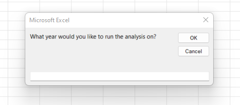
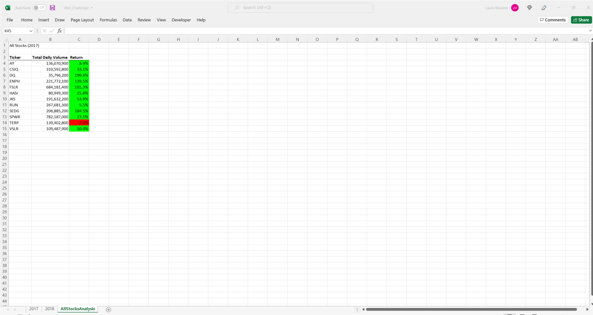
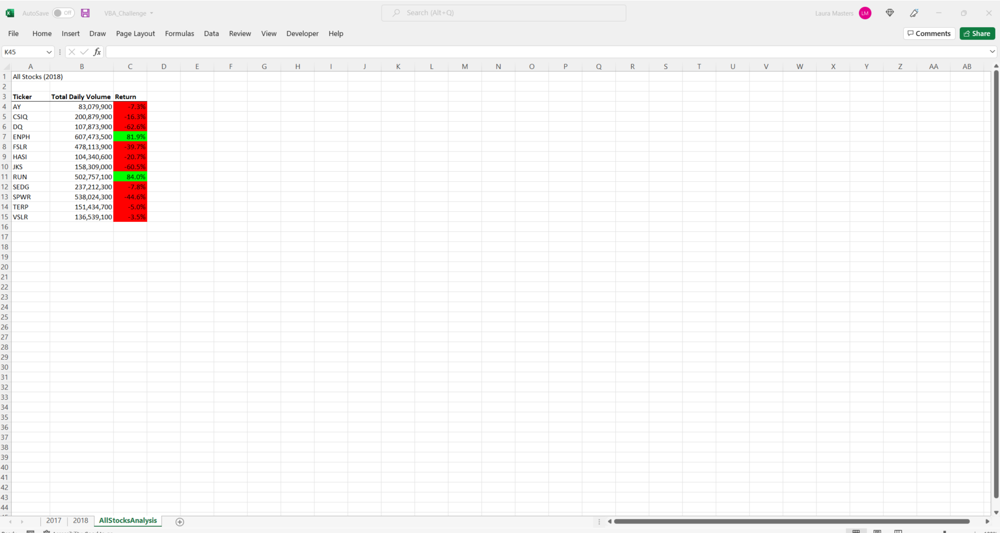
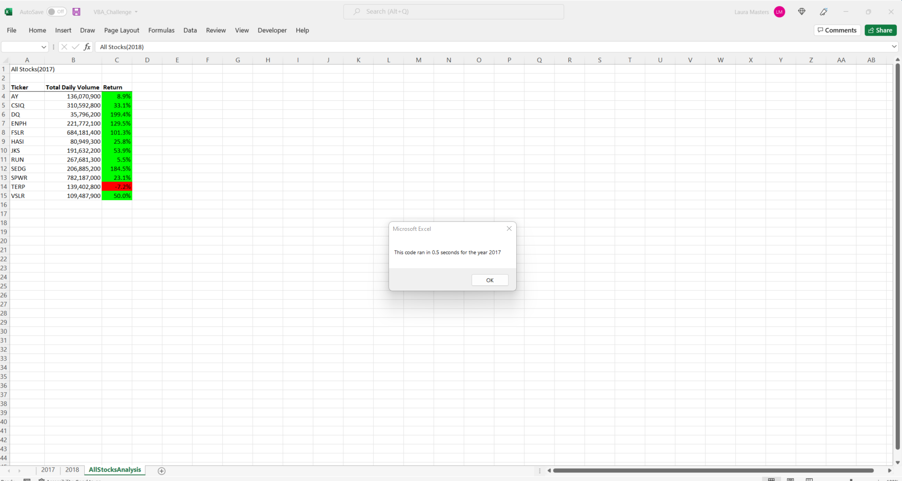
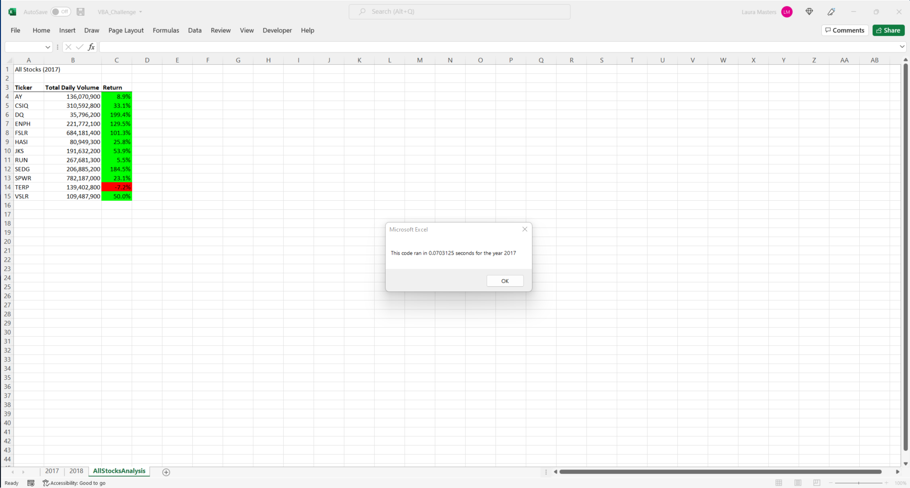
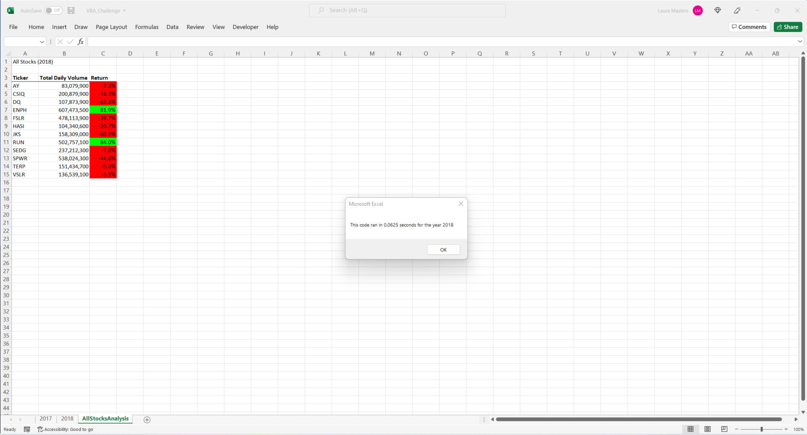

# VBA of Wall Street - Challenge Number Two 

## Overview of Project
    The overview of this project was to conduct an analysis of stock data using Excel and Visual Basic for Applications also referred to as "VBA" to determine what stocks out of a selection of 12 have the best return.    By using a refactored code based off our original code provided in the module,  we were able to use VBA macros to take a workbook with over 3,000 rows of data to shortcut and manipulate the data to achieve desiarable results.  The end result gave two outputs based upon stock data from 2017 and 2018 along with a runtime of each code.   

### Purpose
    The purpose of the project was to be able to refactor code to manipulate data across multiple spreadsheets using macros within Excel VBA.  By using a specific syntax of code and defined variables we were able to ultimately achieve outputs defined as Total Daily Volume and Return for our specific defined variables.  

## Overview of Analysis
    I began the analysis of the data by downloading the excel file and reviewing the columns and rows within the workbook labeled as 2017 and 2018 respectively to have a better understanding of the information I was provided with.  By working through the module, I was able to make updates to an initial macro created called "AllStocksAnalysis." Each step of the module provided a different part to add to the macro resulting in a finished macro that was able to run based upon declared variables, for loops and if/then statements.   By defining variables and creating for loops and if/then statements The initial macro provided an output of data based upon which year you select which is done using the code shown below.  

``` 

     YearValue = InputBox("What year would you like to run the analysis on?") 

``` 

    This code creates the input box which asks the user what year they would like to run the analysis on as displayed here:


   
        

    After inputting the year I was able to see the total daily volume and return for each of the stocks ("tickers").  The return was highlighted green or red dependent upon the percentage of return and whether it was a positive or negative one.  The purpose of the analysis was ultimately to be able to provide a recommendation to invest in a certain stock or stocks based on their volume and rate of return, with those with a higher percentage and volume being the better options to choose.  The refactoring of the code provided us with a different method of achieving the same output but with slightly different and more specific definitions which resulted in a different but faster run time than the initial macro did.  

### Challenges and Difficulties Encountered
    This challenge came with its fair share of setbacks and frustrations, but it was very rewarding.  I understood the concepts behind the macros and what the functions of the variables were, but had a hard time relaying that into code.  After several days and some sleepless nights, I was able to meet with classmates who helped me understand where I was going wrong and get me back on track.  Overall I was overthinking where I didn't need to and complicating the code.  There was not one part of the refactoring process that I can say caused me the most issues as it was all new information to me and it was all challenging.  I can honestly say that have never felt so relieved as to when my code worked with the correct data and output that matched the module! 

## Results
    The overall results of the data were very different when comparing 2017 to 2018.  It can be noted that there is more positive return in the stocks analyzed in 2017 vs. 2018.  The total daily volumes are much higher as well.  There is also only one stock "ticker" that returned a negative return at 7.2% compared to 2018 where almost all of the tickers performed poorly with a negative return.  DQ, the stock that Steve and his parents were most interested in investing in throughout the module, provided the highest rate of return for 2017 but the lowest total daily volume of all the tickers.  The outputs of each year can be seen below.

     
    

  
    

    With regard to the execution time of the code prior to refactoring, I noted that the run time for both 2017 and 2018 was about the same at approximately .5 seconds as shown in the images below.

   
    

    
    

    When refactoring the macro, the run time increased dramatically for both 2017 and 2018.  As shown in the images below, it can be noted that by refactoring the code and making the macro more specific to our needs, we were able to cut down on the overall run time making it more efficient. 

   
    

       
    

## Summary
    As is the case with simply creating a macro from scratch and successfully making it run,  refactoring code can be just as tricky.  The first advantage of refactoring code is that you have an existing code that you are dealing with that works, but may not be as successful in achieving a desired output.  I think we can agree that it is much easier to work on something when don't have to start from scratch.  A second advantage would be that you learn things by working through other people's code that you may not have known which can result in a better more efficient run time.  Working with another person's code can also be a disadvantage as their style may be different and more difficult for you to understand where they are coming from and interpret.  An advantage of refactoring the code for this challenge was that most of the macro was complete, but it changed a lot of the variables from the original example in the module which resulted in having to write and re-write certain lines of the code which were not functioning correctly.  It was difficult for me to erase the formatting for the initial AllStocksAnalaysis macro because was happy when I achieved the desired results that matched the module examples.  By refactoring the code however I was able to put my new found knowledge into practice and achieve the desired result, but with a surprisingly more fast runtime.  Overall I can say that while this challenge did not come easy for me, I have developed a new sense of pride and confidence in coding and I look forward to building upon the knowledge I have learned in the first few weeks for the rest of the program.  
